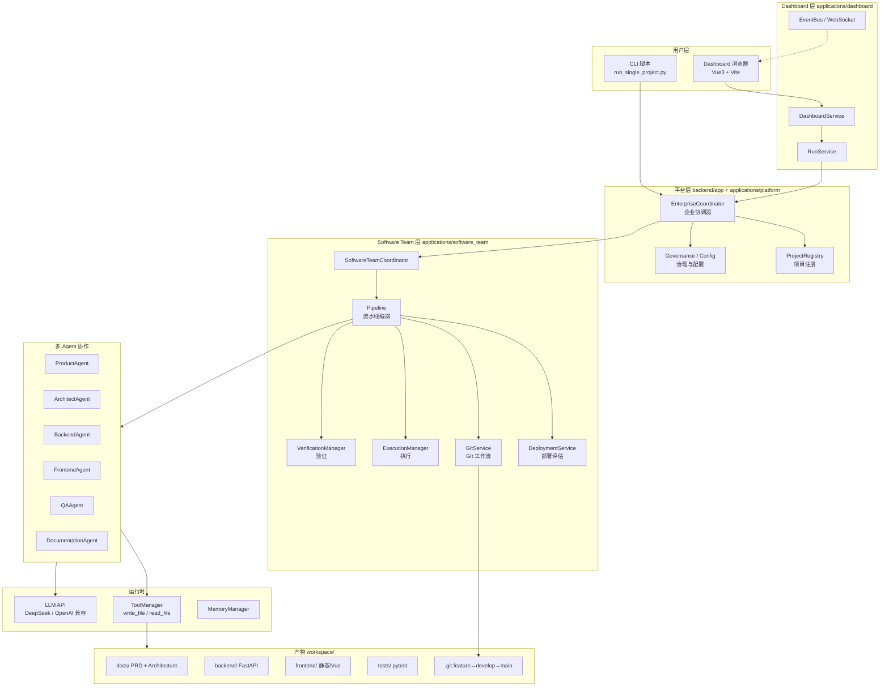
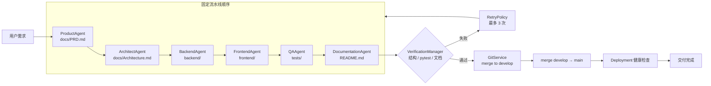
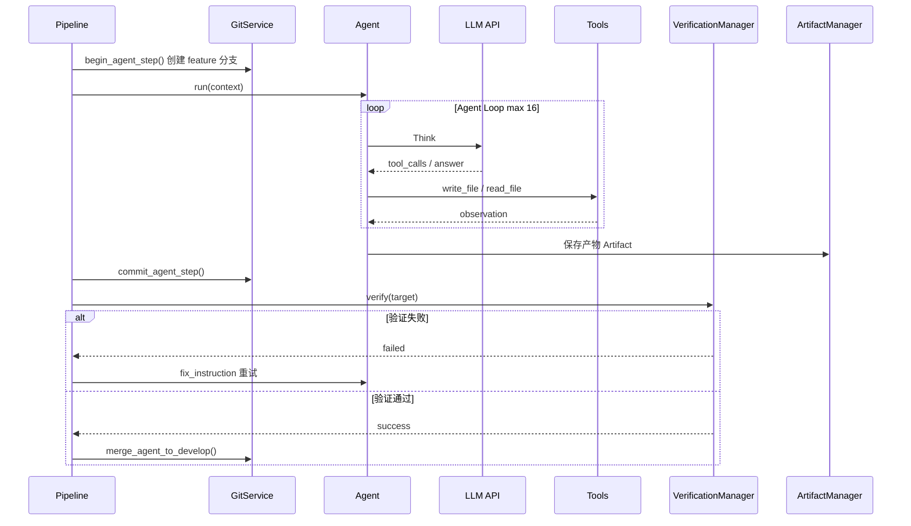
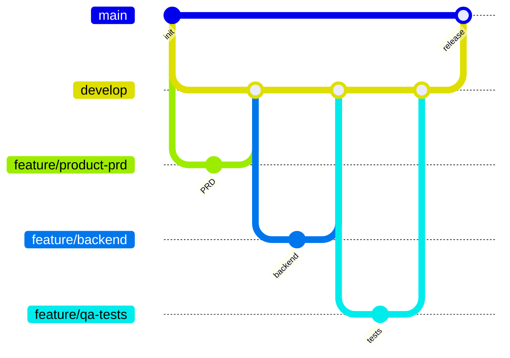
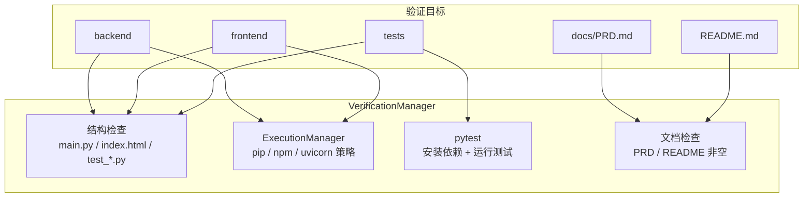

# Enterprise AI Agent — 系统架构图

> 企业级 AI 软件团队平台：从自然语言需求到可运行项目产物的端到端交付。

---

## 1. 总体架构



---

## 2. Agent 流水线



---

## 3. 单 Agent 步骤内部流程



---

## 4. Git 分支策略



每个 Agent 对应一条 `feature/<项目名>-<角色>` 分支，完成后合并到 `develop`；流水线结束时 `develop → main`。

---

## 5. 验证与执行



---

## 6. Demo 部署视图（Run13 图书系统）

```mermaid
flowchart LR
    subgraph Demo["本地演示"]
        B[uvicorn backend.main:app<br/>:8000]
        F[python -m http.server<br/>:5173]
        DB[(SQLite<br/>library.db)]
    end

    SW[Swagger /docs] --> B
    FE[index.html] --> F
    F -->|fetch API| B
    B --> DB

    subgraph API["核心 API"]
        API1[/api/books]
        API2[/api/readers]
        API3[/api/borrowings]
        API4[/api/stats]
    end

    B --> API
```

演示路径：`backend/workspace/library_p0_run13/`  
操作指南：见根目录 [DEMO.md](../DEMO.md)

---

## 7. 技术栈

| 层级 | 技术 |
|------|------|
| 平台后端 | Python 3.11+, FastAPI, Pydantic Settings |
| LLM | OpenAI 兼容 API（DeepSeek 等） |
| Dashboard | Vue 3, Vite, Element Plus, Pinia |
| 生成物后端 | FastAPI, SQLAlchemy 2, SQLite |
| 测试 | pytest, httpx |
| 版本控制 | Git（feature / develop / main） |

---

## 8. 关键目录

```
enterprise-ai-agent/
├── backend/
│   ├── app/                          # 平台 FastAPI 入口
│   ├── applications/
│   │   ├── platform/                 # EnterpriseCoordinator
│   │   ├── dashboard/                # Dashboard 服务
│   │   └── software_team/            # 流水线核心
│   ├── scripts/run_single_project.py
│   └── workspace/library_p0_run13/   # Demo 样例
├── frontend/                         # Dashboard UI
├── docs/ARCHITECTURE.md              # 本文档
├── README.md
└── DEMO.md
```
